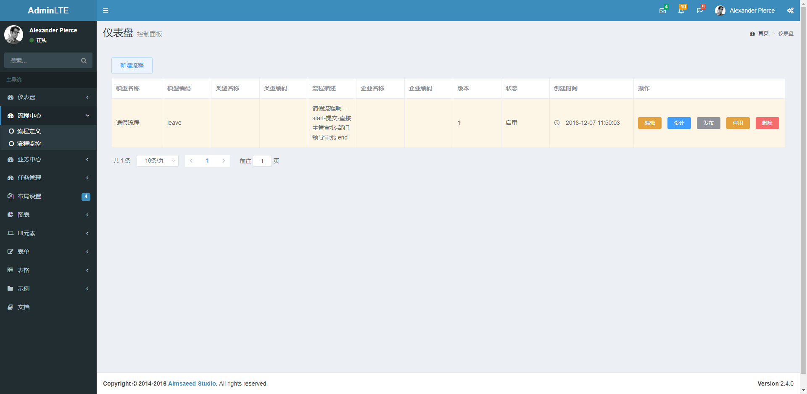
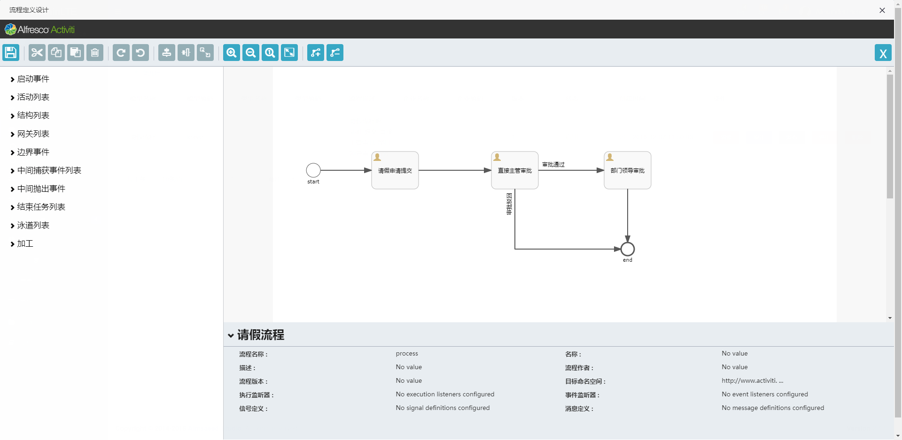
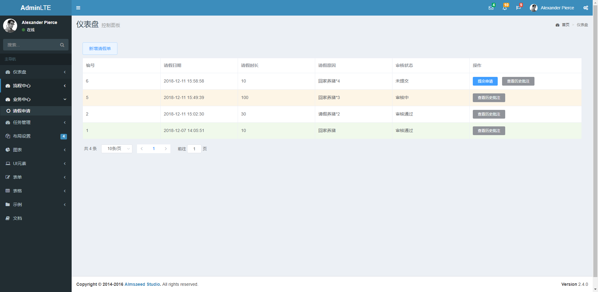
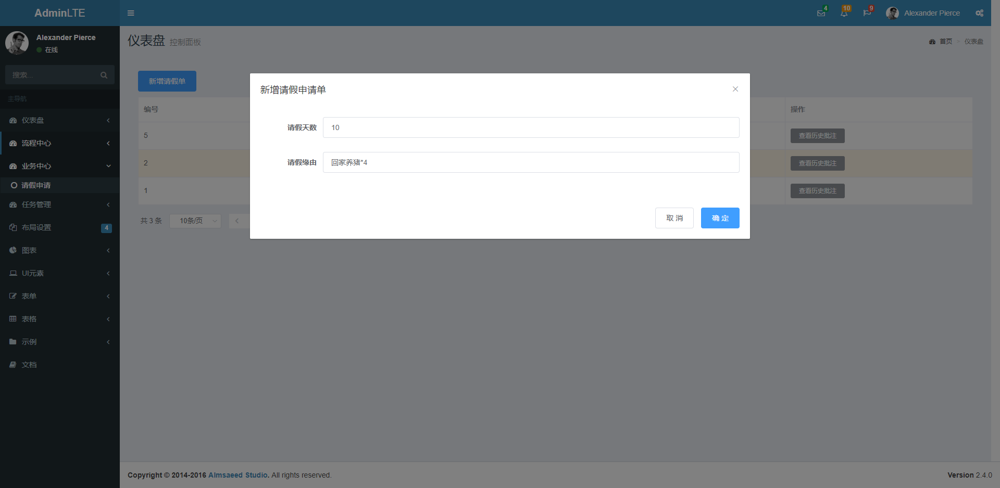
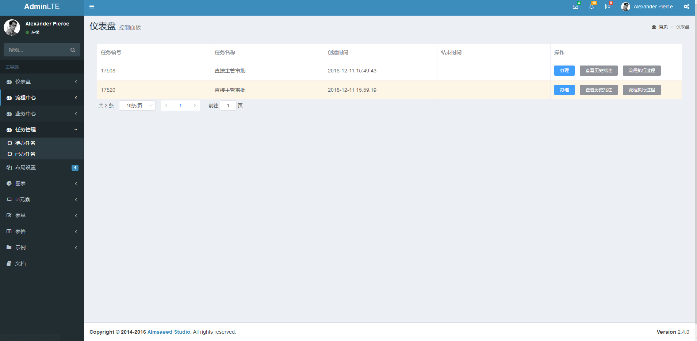
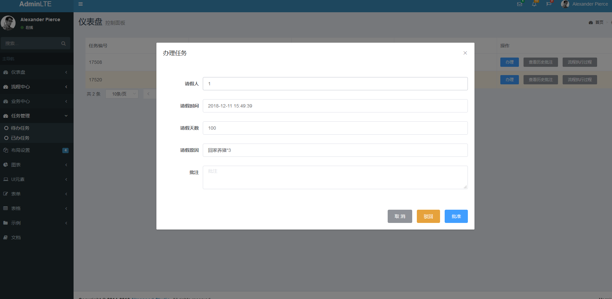
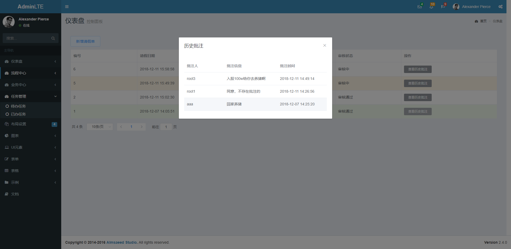
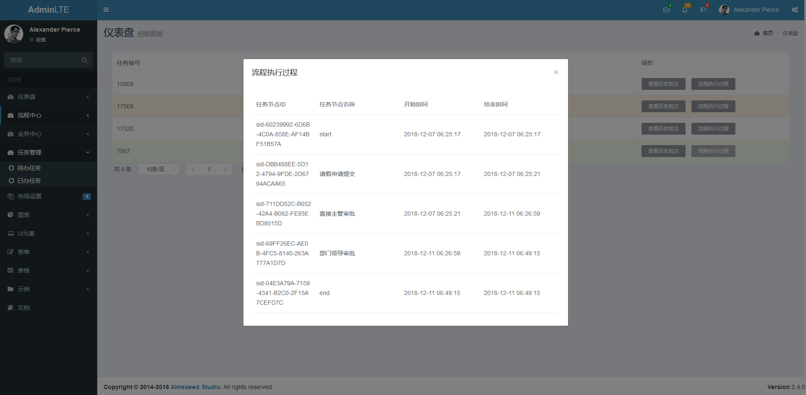

# activiti_simples_web

#### 后台接口见：https://github.com/yywzt/activiti_samples

#### activiti流程中心前端页面

##### 启动项目：

​	npm run dev启动项目

​	 Your application is running here: http://localhost:8081

​	打开浏览器输入上述地址

#### 相关前端 页面展示

##### 流程定义

##### 流程定义设计

##### 请假单

##### 请假单申请

##### 代办任务

##### 审批任务

##### 历史批注

##### 流程执行过程

